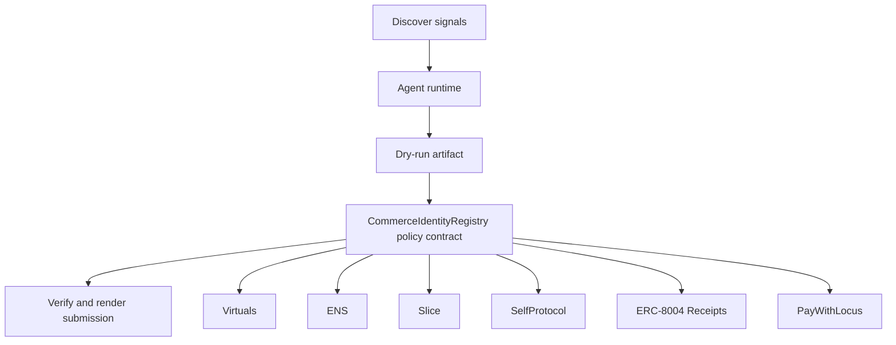

# Commerce Identity Fabric

- **Repo:** [Synthesis-Virtuals](https://github.com/CrystallineButterfly/Synthesis-Virtuals)
- **Primary track:** Virtuals
- **Category:** identity
- **Primary contract:** `CommerceIdentityRegistry`
- **Primary module:** `virtuals_fabric`
- **Submission status:** implementation ready, waiting for credentials and TxIDs.

## What this repo does

An identity fabric that maps agent personas, permissions, and payment surfaces into one reusable commerce and delegation layer.

## Why this build matters

An identity fabric maps agent personas, permissions, and payment surfaces into one reusable layer. The contract records identity state and trust anchors, while Python orchestration ties those identities to commerce and delegation flows.

## Submission fit

- **Primary track:** Virtuals
- **Overlap targets:** ENS, Slice, SelfProtocol, ERC-8004 Receipts, PayWithLocus, SuperRare
- **Partners covered:** Virtuals, ENS, Slice, SelfProtocol, ERC-8004 Receipts, PayWithLocus, SuperRare

## Idea shortlist

1. ERC-8183 Agent Identity Layer
2. ENS-Native Agent Commerce
3. ZK-Protected Persona Wallets

## System graph



## Repository contents

| Path | What it contains |
| --- | --- |
| `src/` | Shared policy contracts plus the repo-specific wrapper contract. |
| `script/Deploy.s.sol` | Foundry deployment entrypoint for the policy contract. |
| `agents/` | Python runtime, project spec, env handling, and partner adapters. |
| `scripts/` | Terminal entrypoints for run, demo planning, and submission rendering. |
| `docs/` | Architecture, credentials, security notes, and demo steps. |
| `submissions/` | Generated `synthesis.md` snippet for this repo. |
| `test/` | Foundry tests for the Solidity control layer. |
| `tests/` | Python tests for runtime and project context. |
| `agent.json` | Submission-facing agent manifest. |
| `agent_log.json` | Local execution log and status trail. |

## Autonomy loop

1. Discover signals relevant to the repo track and its overlap targets.
2. Build a bounded plan with per-action and compute caps.
3. Persist a dry-run artifact before any live execution.
4. Enforce onchain policy through the guarded contract wrapper.
5. Verify outputs, update receipts, and render submission material.

## Security controls

- Admin-managed allowlists for targets and selectors.
- Per-action caps, daily caps, cooldown windows, and a principal floor.
- Reporter-only receipt anchoring and proof attachment.
- Env-only secrets; no committed private keys or partner tokens.
- Pause switch plus dry-run-first execution flow.

## Action catalog

| Action | Partner | Purpose | Max USD | Sensitivity |
| --- | --- | --- | --- | --- |
| `virtuals_identity_sync` | Virtuals | Use Virtuals for a bounded action in this repo. | $5 | medium |
| `ens_ens_publish` | ENS | Use ENS for a bounded action in this repo. | $5 | low |
| `slice_checkout_hook` | Slice | Use Slice for a bounded action in this repo. | $35 | medium |
| `selfprotocol_zk_verify` | SelfProtocol | Use SelfProtocol for a bounded action in this repo. | $3 | high |
| `erc_8004_receipts_receipt_anchor` | ERC-8004 Receipts | Use ERC-8004 Receipts for a bounded action in this repo. | $1 | medium |
| `paywithlocus_subaccount_pay` | PayWithLocus | Use PayWithLocus for a bounded action in this repo. | $120 | medium |
| `superrare_mint_series` | SuperRare | Use SuperRare for a bounded action in this repo. | $40 | medium |

## Local terminal flow (Anvil + Sepolia)

```bash
export SEPOLIA_RPC_URL=https://sepolia.infura.io/v3/YOUR_KEY
anvil --fork-url "$SEPOLIA_RPC_URL" --chain-id 11155111
cp .env.example .env
# keep private keys only in .env; TODO.md stays local-only too
forge script script/Deploy.s.sol --rpc-url "$RPC_URL" --broadcast
python3 scripts/run_agent.py
python3 scripts/render_submission.py
```

## Commands

```bash
python3 -m unittest discover -s tests
forge test
python3 scripts/run_agent.py
python3 scripts/plan_live_demo.py
python3 scripts/render_submission.py
```

## Credentials

| Partner | Variables | Docs |
| --- | --- | --- |
| Virtuals | VIRTUALS_API_URL | https://www.virtuals.io/ |
| ENS | ENS_NAME | https://docs.ens.domains/ |
| Slice | SLICE_API_KEY, SLICE_HOOK_URL | https://docs.slice.so/ |
| SelfProtocol | SELF_PROTOCOL_API_KEY, SELF_VERIFICATION_URL | https://docs.self.xyz/ |
| ERC-8004 Receipts | RPC_URL | https://eips.ethereum.org/EIPS/eip-8004 |
| PayWithLocus | LOCUS_API_KEY, LOCUS_PAYMENT_URL | https://docs.locus.finance/ |
| SuperRare | SUPERRARE_API_KEY, SUPERRARE_MINT_URL | https://superrare.com/ |

## Live demo plan

1. Copy .env.example to .env and fill the required keys.
2. Deploy the contract with forge script script/Deploy.s.sol --broadcast for CommerceIdentityRegistry.
3. Run python3 scripts/run_agent.py to produce a dry run for virtuals_fabric.
4. Set LIVE_MODE=true and rerun python3 scripts/run_agent.py with real credentials.
5. Run python3 scripts/render_submission.py and attach TxIDs plus repo links.
