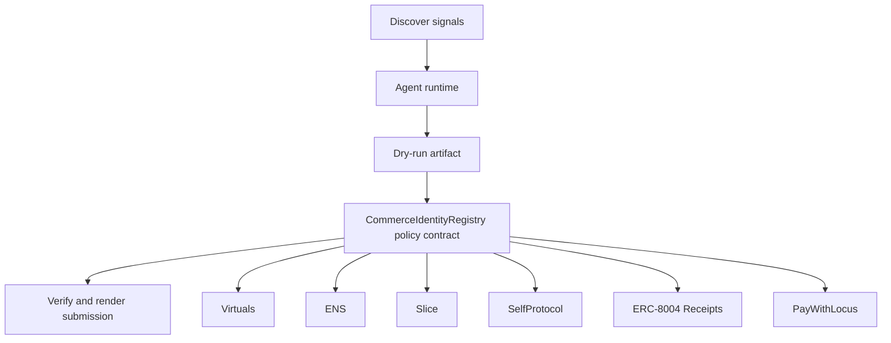

# Commerce Identity Fabric

- **Repo:** `Synthesis-Virtuals`
- **Primary track:** Virtuals
- **Category:** identity
- **Submission status:** implementation ready, waiting for credentials and TxIDs.

An identity fabric that maps agent personas, permissions, and payment surfaces into one reusable commerce and delegation layer.

## Selected concept

An identity fabric maps agent personas, permissions, and payment surfaces into one reusable layer. The contract records identity state and trust anchors, while Python orchestration ties those identities to commerce and delegation flows.

## Idea shortlist

1. ERC-8183 Agent Identity Layer
2. ENS-Native Agent Commerce
3. ZK-Protected Persona Wallets

## Partners covered

Virtuals, ENS, Slice, SelfProtocol, ERC-8004 Receipts, PayWithLocus, SuperRare

## Architecture



## Repository layout

- `src/`: shared policy contracts plus the repo-specific wrapper contract.
- `script/`: Foundry deployment entrypoint.
- `agents/`: Python runtime, partner adapters, and project metadata.
- `scripts/`: CLI utilities for running the loop and rendering submissions.
- `docs/`: architecture, credentials, demo script, and security notes.
- `submissions/`: generated `synthesis.md` snippet for this repo.

## Action catalog

| Action | Partner | Purpose | Max USD | Sensitivity |
| --- | --- | --- | --- | --- |
| `virtuals_identity_sync` | Virtuals | Use Virtuals for a bounded action in this repo. | $5 | medium |
| `ens_ens_publish` | ENS | Use ENS for a bounded action in this repo. | $5 | low |
| `slice_checkout_hook` | Slice | Use Slice for a bounded action in this repo. | $35 | medium |
| `selfprotocol_zk_verify` | SelfProtocol | Use SelfProtocol for a bounded action in this repo. | $3 | high |
| `erc_8004_receipts_receipt_anchor` | ERC-8004 Receipts | Use ERC-8004 Receipts for a bounded action in this repo. | $1 | medium |
| `paywithlocus_subaccount_pay` | PayWithLocus | Use PayWithLocus for a bounded action in this repo. | $120 | medium |
| `superrare_mint_series` | SuperRare | Use SuperRare for a bounded action in this repo. | $40 | medium |

## Commands

```bash
python3 -m unittest discover -s tests
forge test
python3 scripts/run_agent.py
python3 scripts/plan_live_demo.py
python3 scripts/render_submission.py
```

## Credentials

| Partner | Variables | Docs |
| --- | --- | --- |
| Virtuals | VIRTUALS_API_URL | https://www.virtuals.io/ |
| ENS | ENS_NAME | https://docs.ens.domains/ |
| Slice | SLICE_API_KEY, SLICE_HOOK_URL | https://docs.slice.so/ |
| SelfProtocol | SELF_PROTOCOL_API_KEY, SELF_VERIFICATION_URL | https://docs.self.xyz/ |
| ERC-8004 Receipts | RPC_URL | https://eips.ethereum.org/EIPS/eip-8004 |
| PayWithLocus | LOCUS_API_KEY, LOCUS_PAYMENT_URL | https://docs.locus.finance/ |
| SuperRare | SUPERRARE_API_KEY, SUPERRARE_MINT_URL | https://superrare.com/ |

## Live demo plan

1. Copy .env.example to .env and fill the required keys.
2. Deploy the contract with forge script script/Deploy.s.sol --broadcast for CommerceIdentityRegistry.
3. Run python3 scripts/run_agent.py to produce a dry run for virtuals_fabric.
4. Set LIVE_MODE=true and rerun python3 scripts/run_agent.py with real credentials.
5. Run python3 scripts/render_submission.py and attach TxIDs plus repo links.
